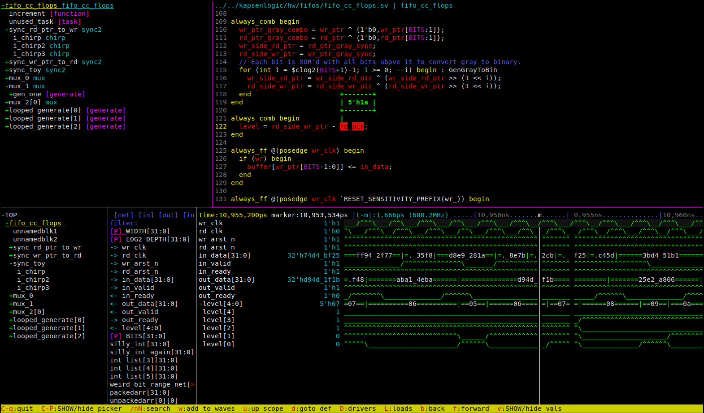

# simview
Simview is a text-based SystemVerilog design browser and waveform viewer. As an
[ncurses](https://en.wikipedia.org/wiki/Ncurses) TUI application, it has very
little library dependencies and can be easily run over an SSH connection in
your favorite terminal emulator. Control of the UI is intuitive and fully
keyboard shortcut driven. While that may sound contradictory, there is nice
contextual help for every function.

Simview is generally meant to debug and analyze hardware designs written in
SystemVerilog. Support for non-synthesizable testbench code is limited.

## Features
* Full design parsing and elaboration, powered by [Surelog](https://github.com/chipsalliance/Surelog).
* Trace signal drivers or loads.
* Waveform format support for VCD and FST, the most common formats written by [Verilator](https://github.com/verilator/verilator).
* Automatic (or manual) matching of wave file hierarchy to design hierarchy.
* Send signals from source code to the wave viewer and vice versa.
* Search source code and signal lists.

## Usage
Simview can be launched with either a VCD/FST wave file, a SystemVerilog
design, or both. To load a wave file use the `-waves <file>` command line
option. All other command line options are passed to the Surelog parser. These
generally match most EDA tools, with things like `-timescale`, `+incdir`,
`+define=val` etc. Use `-help` to get the full list of parsing options from
Surelog.

## Build
Simview is written with C++17 and uses CMake as the build system. Linux is
currently the only supported platform, no Windows or MacOSX support at the
moment.
1. Build and install [Surelog](https://github.com/chipsalliance/Surelog)
1. Build simview:
  * `mkdir build`
  * `cmake ..`
  * `make`

## TODO
A list of features that have not yet been implemented.
* Source viewer: Navigate include files
* Settings file (libconfig)
  * Sort instances by name or by position in file
  * Customizable colors.
  * Source search: whole file or active scope?
* A colorscheme that works with white backgrounds.
* Polish: Syntax highlighting of macros
* Source window: Need a clean way to add multiple signals from the source to the waves at once.
* alternate layout maybe: left has waves and signals stacked vertically
* Expose local nets in functions and tasks
* Expose local variables in always blocks?
* tracing loads does not trace things on the left side, e.g idx isn't traced in `net[idx] = val;`
* Time multiplier for waves (e.g. wave 1 unit is really X us/ns/ps/)
* Wave + source should be able to figure out enums in waves.
* Reload waves, and possibly live updates.
* Search for value in wave.
* Analog signals.
* Detect unrolled arrays in waves, make them expandable in the waveforms
* Lazy / on-demand loading of VCD wave data. Not clear if this is useful since
  loading anything requires parsing the whole file anyway.
* Someday: Support FSDB via dynamically loading the necessary .so's on systems
  that have them installed with a valid license.
