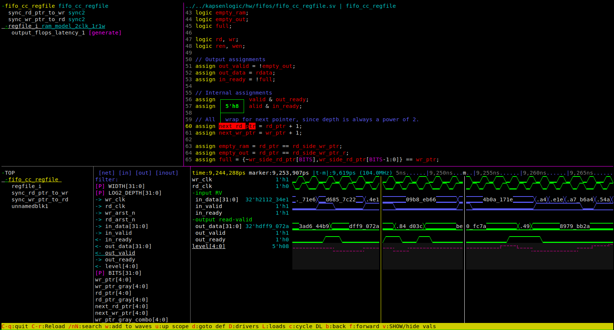

# simview
Simview is a text-based SystemVerilog design browser and waveform viewer. As an
[ncurses](https://en.wikipedia.org/wiki/Ncurses) TUI application, it has very little library
dependencies and can be easily run over an SSH connection in your favorite terminal emulator.
Control of the UI is intuitive and fully keyboard shortcut driven. While that may sound
contradictory, there is nice contextual help for every function.

Simview is generally meant to debug and analyze hardware designs written in SystemVerilog. Support
for non-synthesizable testbench code is limited.

## Features
* Full design parsing and elaboration, powered by [slang](https://github.com/MikePopoloski/slang).
* Trace signal drivers or loads.
* Waveform format support for VCD and FST, the most common formats written by [Verilator](https://github.com/verilator/verilator).
* Automatic (or manual) matching of wave file hierarchy to design hierarchy.
* Send signals from source code to the wave viewer and vice versa.
* Search source code and signal lists.

## Usage
Simview can be launched with either a VCD/FST wave file, a SystemVerilog design, or both. To load a
wave file use the `-waves <file>` command line option. All other command line options are passed to
the slang parser. These generally match most EDA tools, with things like `-timescale`, `+incdir`,
    `+define=val` etc. Use `-help` to get the full list of parsing options from slang.
Tips for UI navigation:
  * Use Tab to cycle through the available panes.
  * Keep an eye on the bottom tooltip bar for available commands.
  * Ctrl-HJKL keys to resize UI panes.
  * Enter/space to expand collapse tree items.
  * vim-style hjkl keys generally work. Also $^ for horizontal and gG for vertical movement.

## Build
Simview is written with C++20 and uses CMake as the build system. Linux or Linux under WSL are
currently the only supported platforms, no native Windows or MacOSX support at the moment.

1. Install pre-requisite packages (Ubuntu 20.04 LTS)
  * `sudo apt install build-essential cmake git pkg-config tclsh swig uuid-dev ninja-build
      libgoogle-perftools-dev python3 python3-orderedmultidict python3-dev default-jre lcov libncurses-dev`
1. Build simview:
  * `git clone git@github.com:pieter3d/simview.git`
  * `cd simview`
  * `mkdir build`
  * `cd build`
  * `cmake ..` or `cmake -GNinja ..`
  * `make`

## TODO
A list of features that have not yet been implemented.
* Source viewer: Navigate include files
* Signals list in a design (not just source + hierarchy).
* Settings file (libconfig)
  * Sort instances by name or by position in file
  * Customizable colors.
  * Source search: whole file or active scope?
  * Save UI layout dimensions?
* A colorscheme that works with white backgrounds.
* Polish: Syntax highlighting of macros
* Source window: Need a clean way to add multiple signals from the source to the waves at once.
* Time multiplier for waves (e.g. wave 1 unit is really X us/ns/ps/)
* Wave + source should be able to figure out enums in waves.
* Search for value in wave.
* Detect unrolled arrays in waves, make them expandable in the waveforms
* Lazy / on-demand loading of VCD wave data. Not clear if this is useful since
  loading anything requires parsing the whole file anyway.
* Someday: Support FSDB via dynamically loading the necessary .so's on systems
  that have them installed with a valid license.
* Command line option to load a saved signal list file at startup.
